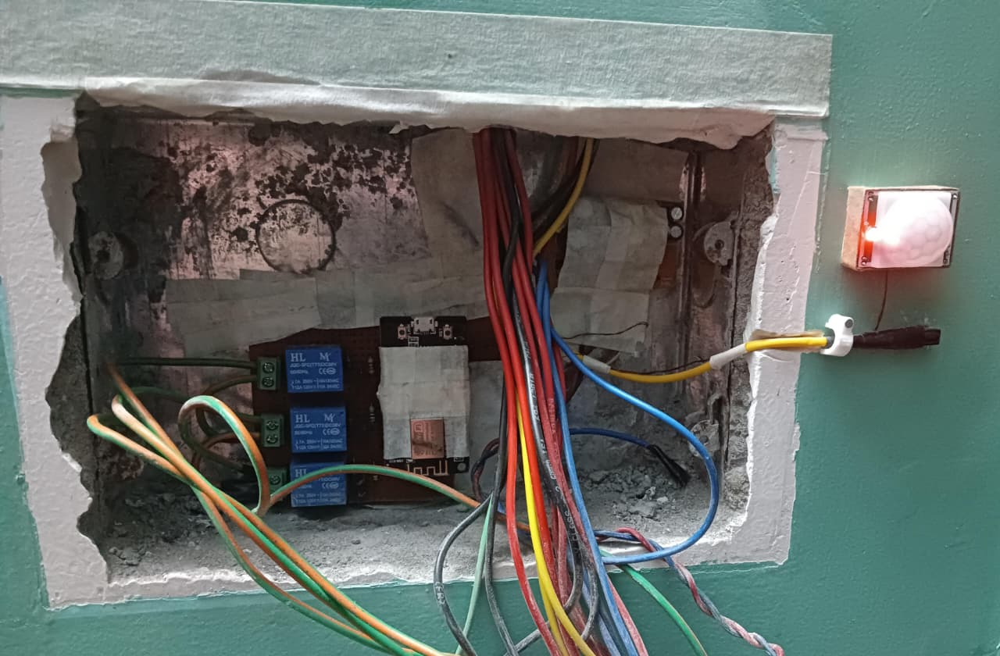
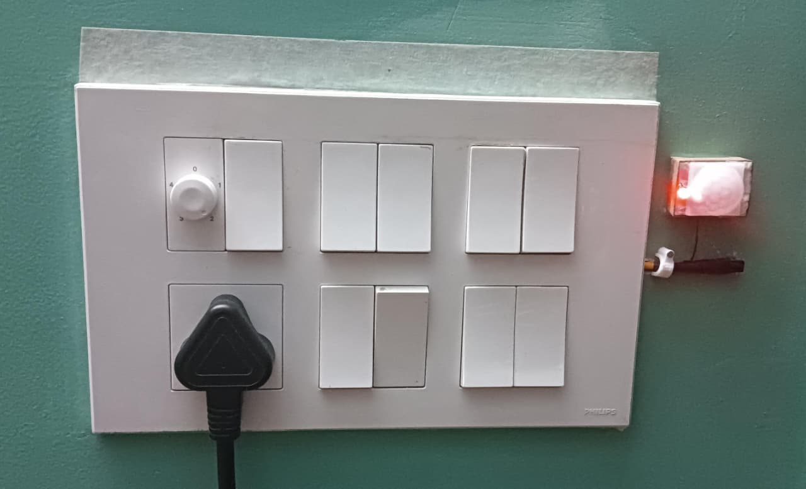
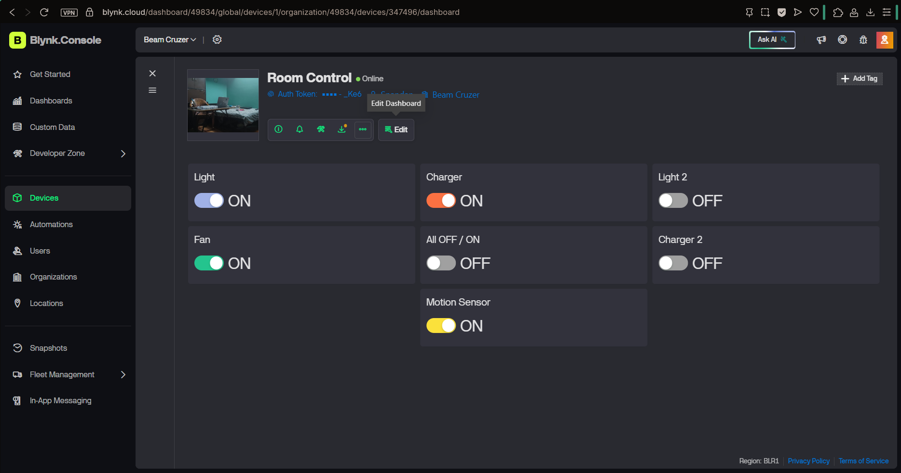
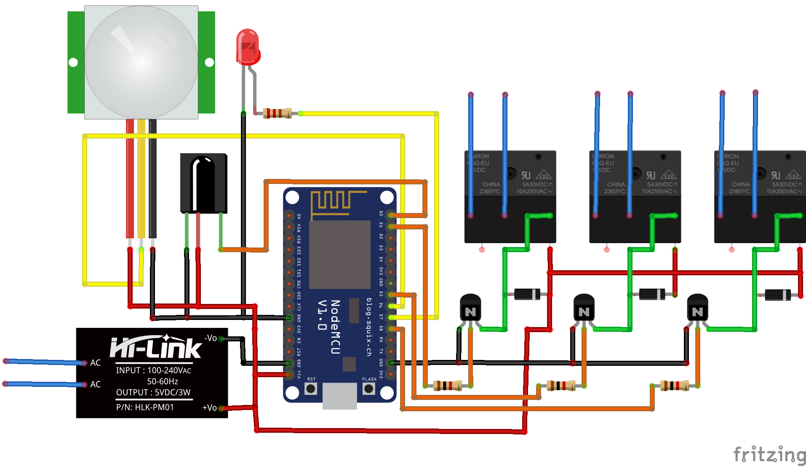

# 🏠 IoT-Based Home Automation System using ESP8266 & Blynk

A robust **IoT-enabled home automation system** built using **ESP8266 NodeMCU** and **Blynk**, allowing users to remotely monitor and control household appliances from **anywhere in the world** via **mobile or web dashboard**.  
The system also supports **offline control**, **motion-based automation**, **timed operations**, and **real-time notifications** for enhanced safety and energy efficiency.

---

## ✨ Key Features

### 🌐 Remote Appliance Control
- Control **multiple electrical appliances** (Light, Fan, Charger, etc.) using a **3-channel relay module**
- Operate devices over the **internet** via **Blynk Android app** and **Blynk Web Dashboard**
- Real-time ON/OFF status feedback for each appliance

---

### 📡 Internet & Offline Operation
- Works over **WiFi** when internet is available
- **Offline control support** using **TSOP1738 IR receiver**
- Appliances can be controlled using a standard **IR remote** (TV remote)
- Requires **direct line-of-sight**, similar to conventional TV operation

---

### 🔄 Over-The-Air (OTA) Firmware Updates
- Supports **OTA firmware updates** using **AsyncElegantOTA**
- Allows uploading new firmware directly through the device **IP address** via a HTTP webpage using "device_local_ip/update"
- Eliminates the need for physical USB connection during updates
- Firmware can also be updated remotely using the **Blynk OTA page** in the webdashboard

---

### 🚶 Motion-Based Automation
- Integrated **HC-SR501 PIR motion sensor**
- Automatically turns ON room lights or appliances when motion is detected
- Automatically turns OFF devices after a **configurable idle time**
- Ideal for **energy saving** and convenience

---

### ⏱️ Time-Based Automations
- Create **timed schedules** to control appliances
- Example:
  - Turn ON charger for **1 hour 30 minutes**
  - Automatically turn OFF after completion
- Helps prevent **overcharging** of mobile phones and laptops
- Reduces unnecessary power consumption

---

### 🚨 Security & Emergency Notifications
- Instant **push notifications** sent to mobile device on motion detection
- Useful for **intrusion alerts** and theft prevention
- Enables real-time awareness even when away from home

---

## ⚙️ System Specifications

| Component | Description |
|---------|------------|
| Microcontroller | **ESP8266 NodeMCU** with built-in WiFi |
| Relay Module | 3-Channel Relay (AC load switching up to **10A**) |
| Motion Sensor | HC-SR501 PIR Sensor |
| IR Receiver | TSOP1738 |
| Control Platform | **Blynk (Mobile App & Web Dashboard)** |
| Communication | WiFi (Client–Server Model) |


---

## 🖼️ Hardware Setup
#### Internal Wiring


#### Final Enclosure


## 📱 Blynk App Interface
#### Android App UI


#### Blynk Webdashboard UI


## 🔌 Circuit Diagram


---

## 💻 Code Overview
```c
//Blynk Configuration
#define BLYNK_TEMPLATE_ID "TMPLeKFBNU8k"
#define BLYNK_DEVICE_NAME "Room Control"

// Relay Pin Definitions
#define fan D1
#define charger D8
#define light D5

// PIR Motion Sensor
#define pir D6                    
#define led D7 //PIR motion sensor activation indicator

// IR Receiver
#define IR_PIN D0
```

---

## 🛠 Installation & Setup

### 1️⃣ Firmware Upload (ESP8266)
1. Open **Arduino IDE**
2. Install **ESP8266 Board Package** via Board Manager
3. Navigate to the `firmware/` folder and open the `.ino` file
4. Select the correct **NodeMCU ESP8266 board** and **COM port**
5. Upload the firmware to the ESP8266

---

### 2️⃣ WiFi Configuration via Blynk
1. Power ON the ESP8266 after flashing
2. The device will create a **WiFi Access Point**
3. Connect to this access point using your mobile phone
4. Open the **Blynk mobile application**
5. Enter your **WiFi SSID and password** through the app
6. The credentials are sent to the ESP8266 and stored automatically

---

### 3️⃣ Blynk Dashboard Setup
1. Create a new project in the **Blynk app**
2. Select **ESP8266** as the hardware device
3. Add required widgets (Buttons, Timer, Notifications)
4. Assign the correct **Virtual Pins** as defined in the firmware
5. Save the dashboard and start controlling appliances in real time

---

### 4️⃣ Library Installation
1. Navigate to the `library/` folder in this repository and download all the zip files
2. Open **Arduino IDE**
3. Go to **Sketch → Include Library → Add .ZIP Library**
4. Select each zip libraries one by one and install it
5. Restart Arduino IDE after installing all libraries

---

## 🧠 Working Principle

- The ESP8266 acts as a **WiFi client** and connects to the Blynk cloud server
- User inputs from mobile or web dashboard are sent to the server
- The server processes the request and sends commands back to the ESP8266
- The microcontroller switches appliances using relay outputs based on logic
- Sensor data (motion status, relay state) is continuously synced with Blynk for real-time feedback

---

## 🧰 Technologies Used

- **ESP8266 NodeMCU**
- **Blynk IoT Platform**
- **Embedded C / Arduino Framework**
- **WiFi Communication**
- **Relay-Based AC Load Switching**
- **IR Remote Control**
- **PIR Motion Detection**

---

## ⚠️ Safety Notes
- Ensure proper electrical isolation while switching AC loads
- Use relay modules with opto-isolation
- Do not exceed 10A load current
- Handle mains voltage with extreme caution

---

## 📜 License

This project is licensed under the **MIT License** — feel free to use, modify, and distribute.

---

## 🙌 Author

**Spandan Choudhury**  
Embedded Systems | Robotics | IoT  
GitHub: `@BeamCruzer`

---

## ⭐ Support

If you like this project, consider giving it a **Star** ⭐ on **GitHub!**

---

